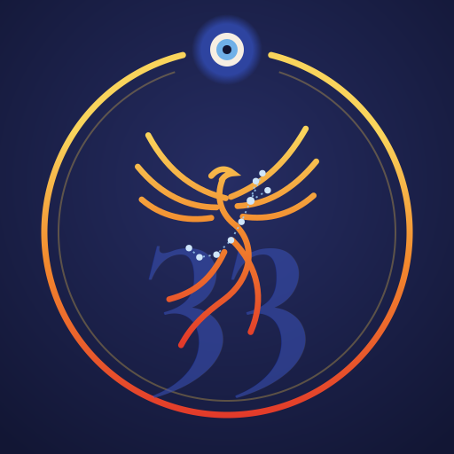
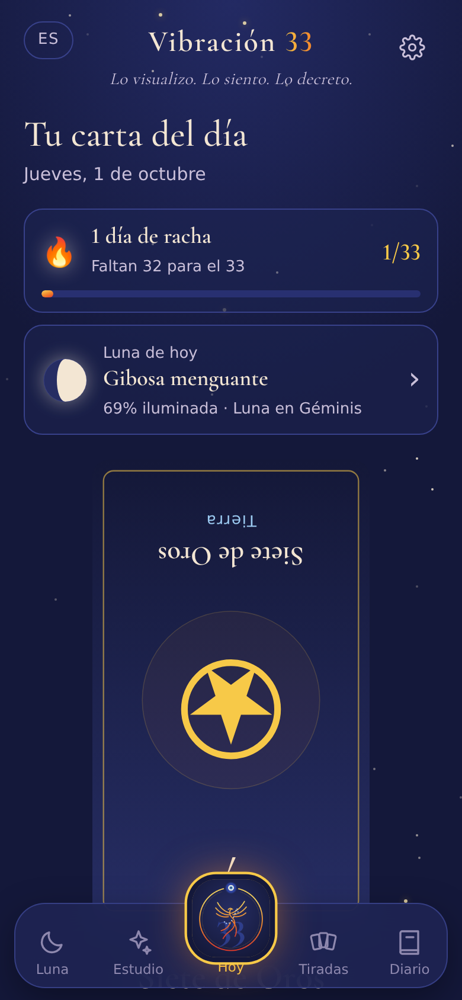
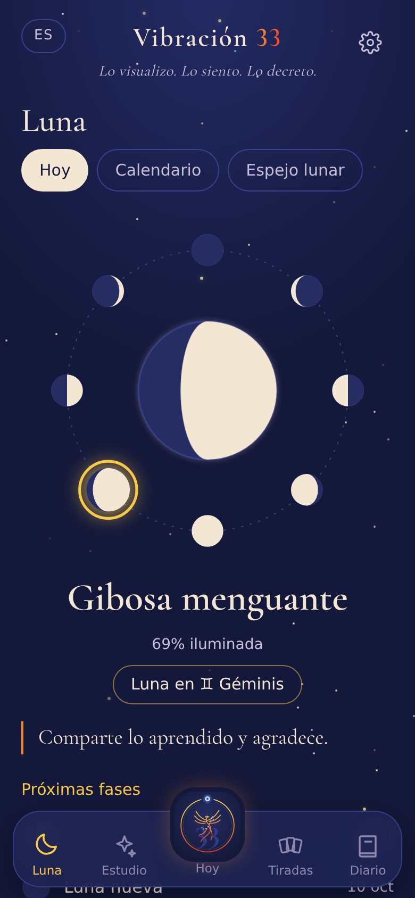

  

<h1 align="center">Vibración 33</h1>

<em>Lo visualizo. Lo siento. Lo decreto.</em>

  App personal para aprender tarot con un ritual diario, las fases de la luna y un diario de lecturas. 
  Creada con intención por <strong>Melitalove</strong> · Áureo

  <a href="https://melilove.github.io/vibracion33/"><strong>Abrir la app</strong></a>

  
  &nbsp;&nbsp;
  

---

## ✦ Qué es

Vibración 33 es una app web instalable (PWA) para familiarizarse con las 78 cartas del tarot antes y durante el uso de un mazo físico. Une el estudio de las cartas con un ritual diario de decreto, el ciclo lunar y un diario que revela patrones en el tiempo.

Funciona sin internet, se instala en el celular con su propio ícono y guarda todo solo en el dispositivo.

## ✦ Secciones

| Sección | Qué incluye |
|---|---|
| **Hoy** (Sello 33) | Ritual diario del decreto, racha de días con meta 33, luna del día y carta del día con interpretación propia. |
| **Luna** | Ciclo de 8 fases con la luna de hoy destacada, signo de la luna, calendario mensual y Espejo lunar (qué cartas salen en cada fase). |
| **Estudio** | Mazo completo con significados derecho e invertido, tarjetas de memoria, mis números (numerología) y Mi cielo (Sol, ascendente y descendente). |
| **Tiradas** | Tirada del Decreto (Visualizo · Siento · Decreto), tirada de cumpleaños, dados astrológicos y clásicos, y lecturas con el mazo físico. |
| **Diario** | Todas las lecturas con la fase lunar del día, carta más repetida y energía por palo. |

## ✦ Funciones destacadas

- **Ritual del decreto:** la primera vez que se abre la app cada día, el decreto aparece frase por frase, con opción de escucharlo en la propia voz.
- **Racha 33:** cuenta los días seguidos de ritual y celebra al llegar a 33.
- **Luna calculada en el celular:** fase, porcentaje iluminado, signo y próximas fases, dibujada como se ve desde el hemisferio sur (configurable).
- **Mi cielo:** con fecha, hora y ciudad de nacimiento calcula Sol, ascendente, descendente y luna natal (considerando el horario de verano de esa fecha), con la carta del tarot de cada signo. Funciona para perfiles propios y de conocidos.
- **Compartir en Instagram:** genera imágenes de historia o post con la carta del día o el cielo de un perfil, con la marca Melitalove · Áureo.
- **Tres idiomas:** español, inglés e italiano, incluidos los significados de las 78 cartas.
- **Sin conexión:** las 78 ilustraciones se pueden guardar en el celular desde Ajustes.

## ✦ Instalar en Android

1. Abre el link **directamente en Chrome** (no desde WhatsApp ni Instagram).
2. Espera unos segundos a que cargue.
3. Toca **"Instalar Vibración 33"** en la pantalla Hoy, o en el menú ⋮ → **Instalar app**.
4. Ya instalada, ve a **Ajustes → Mazo sin internet → Guardar**.

> Evita "Agregar a pantalla principal": esa opción crea un acceso directo con el logo de Chrome en vez de instalar la app.

## ✦ Instalar en iPhone

Abre el link en Safari → botón **Compartir** → **Agregar a inicio**.

## ✦ Archivos

| Archivo | Uso |
|---|---|
| `index.html` | La app completa: diseño, lógica y textos de las 78 cartas en 3 idiomas. |
| `manifest.json` | Nombre, colores e íconos para instalarla como app. |
| `sw.js` | Service worker: funcionamiento sin internet y actualizaciones. |
| `icon-192.png` · `icon-512.png` | Ícono del Sello 33. |
| `icon-maskable-512.png` | Ícono adaptable para Android. |
| `apple-touch-icon.png` | Ícono para iPhone. |
| `captura-1.png` · `captura-2.png` | Capturas que muestra Chrome al instalar. |

## ✦ Actualizar la app

Al subir cambios, sube también el número de versión en `sw.js` (por ejemplo `vibracion33-v1.5.1`). Así el celular descarga la versión nueva.

## ✦ Privacidad

Lecturas, notas, perfiles y grabación de voz se guardan **solo en el celular**. No hay cuentas, servidores ni seguimiento. Desde Ajustes se puede descargar y restaurar un respaldo.

## ✦ Tecnología

HTML, CSS y JavaScript sin dependencias · PWA con service worker · almacenamiento local · cálculo astronómico simplificado para la luna y el sol · Canvas para las imágenes de Instagram · alojada en GitHub Pages.

## ✦ Créditos

- Ilustraciones: tarot **Rider-Waite-Smith (1909)**, de Pamela Colman Smith. Dominio público, vía Wikimedia Commons.
- Significados, diseño, Sello 33 y textos: Melitalove.
- Tipografías: Cormorant Garamond y Jost (Google Fonts).

La numerología y la astrología se presentan como tradiciones simbólicas, para inspiración y autoconocimiento.

---

  <strong>Vibración 33</strong> · versión 1.5.0 
  Creado con intención por <strong>Melitalove</strong> · <a href="https://www.instagram.com/melita_love/">@melita_love</a> · Áureo · <a href="https://melitalove.com">melitalove.com</a> 
  © 2026 Melitalove

